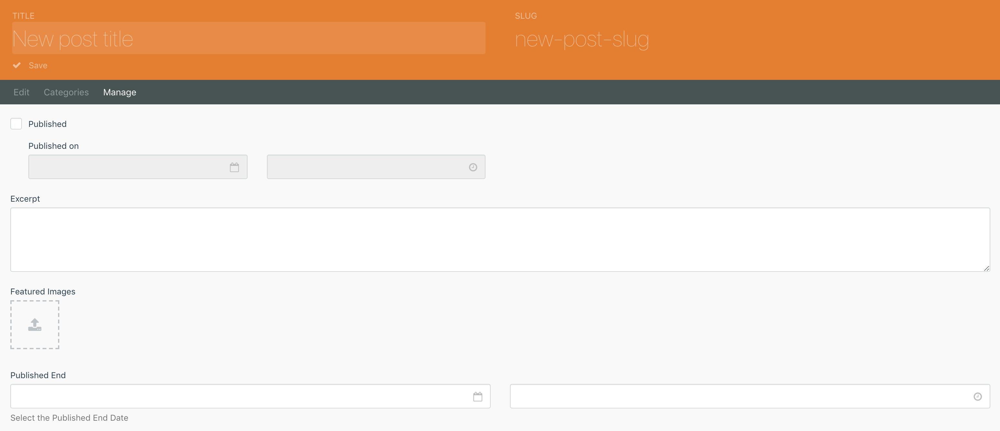

# Published End at Blog

This plugin extend Rainlab Blog Plugin to also specifying date when blog stop to publish.



To filter only showing blog that not reaching the published_end date, extend the *blogPosts* component and add filter like this

```twig
    
    
```